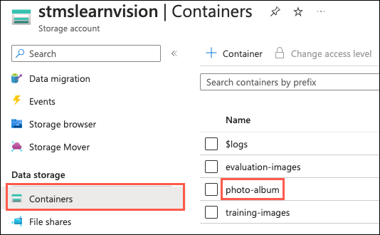
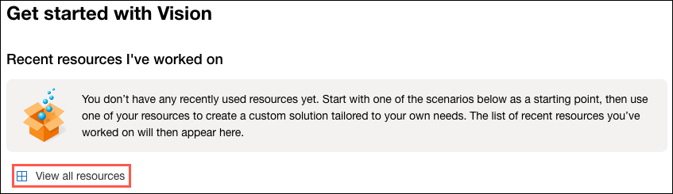
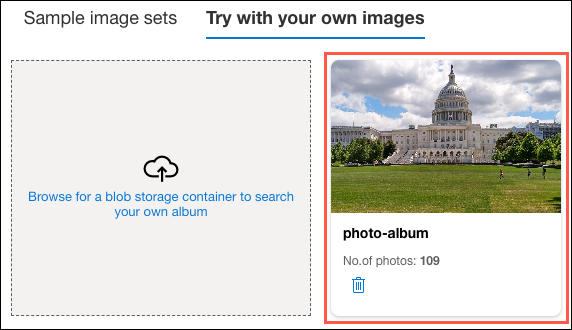
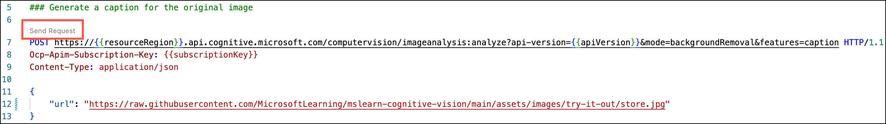
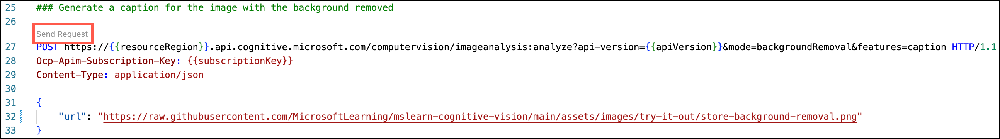

The Image Analysis 4.0 features available in Cognitive Services for Vision include numerous capabilities for understanding image content and context and extracting information from images. Vision Studio allows you to try out many of the capabilities of Image Analysis 4.0 quickly and easily in a web browser. In this exercise, you will use Vision Studio to analyze images using the built-in try-it-out experiences. You will also use Visual Studio Code to make a few calls to the Image Analysis 4.0 APIs to explore features not available in Vision Studio.

## Provision Azure resources

Before using Vision Studio to try out the capabilities of Image Analysis 4.0, you must prepare your Azure environment by creating a few resources required to complete the exercises in this module. You will use the Azure CLI to provision and configure the following resources:

- A resource group
- An Azure Cognitive Service account
- An Azure Storage account

1. Navigate to the [Azure portal](https://portal.azure.com/) in a web browser, then open the **Azure Cloud Shell** via the link in the navigation bar at the top of the portal.

    

2. If prompted, select **Bash**.

    

3. If prompted, select the subscription you are using for the exercises associated with this module, and then select **Create storage**.

    

4. At the Cloud Shell command prompt, enter the following Azure CLI command to create an Azure resource group named `rg-ms-learn-vision` in the `East US` region within your subscription:

    ```azurecli
    az group create --name rg-ms-learn-vision --location eastus
    ```

5. Once your resource group has been created, use the below Azure CLI command to create an Azure Cognitive Services account. Before running the command, replace the `SUFFIX` token in the Cognitive Services account name with your initials or another value to ensure the resource name is globally unique.

    ```azurecli
    az cognitiveservices account create --name cog-ms-learn-vision-SUFFIX --resource-group rg-ms-learn-vision --kind CognitiveServices --sku S0 --location eastus --yes
    ```

    Image Analysis 4.0 features are currently available in a limited number of Azure regions. Specifying `East US` ensures access to the 4.0 features from Vision Studio.

6. The last resource you need to create is an Azure Storage account for hosting some of the images you will use to try out the Image Analysis 4.0 features and create your custom object detection model in the next exercise. Run the following command to create a Storage Account in the resource group you created for this exercise. Before running the command, make sure to replace the `SUFFIX` token in the Storage Account name with your initials or another value to ensure the resource name is globally unique.

    ```azurecli
    az storage account create -n stmslearnvisionSUFFIX -g rg-ms-learn-vision -l eastus --sku Standard_LRS
    ```

7. Once your storage account has been created, use the following command to create a container for hosting your images. Before running the command, make sure to replace the `[YOUR_STORAGE_ACCOUNT_NAME]` token with the name you assigned to your storage account in the previous step.

    ```azurecli
    az storage container create --account-name [YOUR_STORAGE_ACCOUNT_NAME] --name photo-album --auth-mode login
    ```

8. Create a second container for hosting the training images you will use in the next exercise. Again, replace the `[YOUR_STORAGE_ACCOUNT_NAME]` token with the name you assigned to your storage account above.

    ```azurecli
    az storage container create --account-name [YOUR_STORAGE_ACCOUNT_NAME] --name training-images --auth-mode login
    ```

9. Repeat the above steps to create a third container for hosting the images you will use in the next exercise to evaluate your custom model. Again, replace the `[YOUR_STORAGE_ACCOUNT_NAME]` token with the name you assigned to your storage account above.

    ```azurecli
    az storage container create --account-name [YOUR_STORAGE_ACCOUNT_NAME] --name evaluation-images --auth-mode login
    ```

10. You can now close the Azure Cloud Shell pane in your browser window.

## Configure a CORS rule on the storage account

Before moving on to trying out the Image Analysis 4.0 features from Vision Studio, you must enable CORS on your Storage Account to allow Vision Studio to connect to it and search for images.

1. In the Azure portal browser windows, navigate to the `rg-ms-learn-vision` resource group and select the `stmslearnvisionSUFFIX` Storage Account.

2. On the Storage Account page, scroll down in the left-hand navigation menu and select **Resource sharing (CORS)** under *Settings**.

    

3. On the **Resource Sharing (CORS)** page, enter the following on the **Blob service** tab:

    - **Allowed origins**: Enter <https://portal.vision.cognitive.azure.com>.
    - **Allowed methods**: Select the **GET** checkbox to allow an authenticated request from a different domain.
    - **Max age**: Enter **9999**.

    

4. Select **Save** on the **Resource sharing (CORS)** toolbar.

## Download sample images

You will use several images for the exercises below, which you must retrieve from a local folder. In this task, you will download a zip file from a GitHub repository and unzip it to a local directory.

1. Download the zip file containing sample images from here: <https://github.com/MicrosoftLearning/mslearn-cognitive-vision/blob/main/assets/images.zip?raw=true>

2. Unzip the `images.zip` file to an easily accessible location on your local machine.

## Update images to Azure Storage

Some of the images you download need to be added to the Azure Storage account you created above to be accessible by the try-it-out experiences. In this task, you will upload the required images to containers in blob storage.

1. In a web browser, navigate to the [Azure portal](https://portal.azure.com/) and browser to the Storage Account resource in the `rg-ms-learn-vision` resource group you created above, then select **Containers** under **Data storage** in the left-hand navigation menu.

2. Select the 'photo-album' container on the **Containers** page.

    

3. On the **photo-album** page, select **Upload** from the toolbar.

    

4. On the **Upload blob** dialog, select **Browse for files**, navigate to the `photo-album` folder in the `images` folder you downloaded to your local machine, select all the files in the folder, and then select **Open** to add the files to the upload process.

    

5. Select **Upload** to upload all files into the `photo-album` container.

    When the upload completes, you should receive a message that 109 blobs were successfully uploaded.

    

6. Repeat steps 3 through 5 above, this time selecting the `training-images` container and retrieving all of the images from the `training-images` folder in your download location.

    When the upload has finished, you should receive a message that 53 blobs were successfully uploaded.

7. Repeat steps 3 through 5 above, this time selecting the `evaluation-images` container and retrieving all of the files from the `evaluation-images` folder in your download location.

    When the upload completes, you should see a message that 16 blobs were successfully uploaded.

    **Note**: The `evaluation-images` folder also contains a JSON file named `eval-labels.json`. Make sure to upload this file as well. It is the COCO file describing the labels applied to the evaluation image dataset.

## Connect your Cognitive Services resource to Vision Studio

In this task, you will connect the Cognitive Services resource you provisioned above to Vision Studio so it can be used for trying out the various Image Analysis 4.0 features.

1. In a web browser, navigate to [Vision Studio](https://portal.vision.cognitive.azure.com/).

2. Sign in with your account and making sure you are using the same directory as the one where you have created the `cog-ms-learn-vision-SUFFIX` Cognitive Services resource.

3. On the Vision Studio home page, select **View all resources** under the **Getting started with Vision** heading.

    

4. On the **Select a resource to work with** page, hover your mouse cursor over the `cog-ms-learn-vision-SUFFIX` resource you created above in the list and then check the box to the left of the resource name, then select **Select as default resource**.

    

## Generate captions for an image

You are ready to use [Vision Studio](https://portal.vision.cognitive.azure.com/) to examine Image Analysis 4.0 capabilities. In this task, you look at the image captioning functionality of Cognitive Services for Vision. Image captions are available through the **Caption** and **Dense Captions** features in Image Analysis 4.0.

1. In a web browser, navigate to [Vision Studio](https://portal.vision.cognitive.azure.com/).

2. On the **Getting started with Vision** landing page, select the **Image analysis** tab and then select the **Add captions to images** tile.

    

3. Open the folder containing the images you downloaded and unzipped and locate the file named `city-street.jpg` within the `try-it-out` folder.

    

4. Drag the `city-street.jpg` image from the `try-it-out` folder into the **Drag and drop files here** box, or browse to the location you downloaded the file and select it.

    

5. Observe the generated caption text, visible in the **Detected attributes** panel to the right of the image.

    The **Caption** functionality provides a single, human-readable English sentence describing the image's content.

6. Select the **JSON** tab to view the full output from the API. It should look similar to the following:

    ```json
    {
      "captionResult": {
        "text": "a man walking a dog on a leash on a street",
        "confidence": 0.5456792116165161
      },
      "modelVersion": "2023-02-01-preview",
      "metadata": {
        "width": 800,
        "height": 533
      }
    }
    ```

    The JSON output includes the text of the generated caption, a confidence score, and metadata about the file and version of the model used to perform the image analysis.

7. Next, use the same image to perform **Dense captioning**. Return to the **Vision Studio** home page, and as you did before, select the **Image analysis** tab, then select the **Dense captioning** tile.

    

    The **Dense Captions** feature of Image Analysis 4.0 differs from the **Caption** capability in that it provides multiple human-readable captions for an image, one describing the image's content and others, each covering the essential objects detected in the picture. Each detected object includes a bounding box, which defines the pixel coordinates within the image associated with the object.

8. Drag the `city-street.jpg` image from the `try-it-out` folder into the **Drag and drop files here** box, or browse to the location you downloaded the file and select it.

    

9. Hover over one of the captions in the **Detected** attributes list and observe what happens within the image.

    

    Move your mouse cursor over the other captions in the list, and notice how the bounding box shifts in the image to highlight the portion of the image used to generate the caption.

10. Select the **JSON** tab and review the structure. The JSON contains the text of each caption, a confidence score, and the coordinates of the bounding box assigned to each object for which captions were generated.

    ```json
    {
      "denseCaptionsResult": {
        "values": [
          {
            "text": "a man walking a dog on a leash on a street",
            "confidence": 0.5456792116165161,
            "boundingBox": {
              "x": 0,
              "y": 0,
              "w": 800,
              "h": 533
            }
          },
          ...
          {
            "text": "a yellow taxi cab on a street",
            "confidence": 0.39235755801200867,
            "boundingBox": {
              "x": 0,
              "y": 205,
              "w": 275,
              "h": 149
            }
          }
        ]
      },
      "modelVersion": "2023-02-01-preview",
      "metadata": {
        "width": 800,
        "height": 533
      }
    }
    ```

## Tagging images

The next feature you will try is the **Extract Tags** functionality of Image Analysis 4.0. Extract tags is based on thousands of recognizable objects, including living beings, scenery, and actions.

1. Return to the home page of Vision Studio, then select the **Extract common tags from images** tile under the **Image analysis** tab.

    

2. In the **Choose the model you want to try out**, leave **Pretrained Vision model** selected.

3. Open the folder containing the images you downloaded and unzipped and locate the file named `shopping.jpg` within the `try-it-out` folder.

4. Drag the `shopping.jpg` file into the **Drag and drop a file here** box, or select **Browse for a file** and retrieve the `shopping.jpg` file from the location you saved it to your local computer.

    

5. Review the list of tags extracted from the image and the confidence score for each in the detected attributes panel.

    | Image | Tags  |
    | :---: | :---: |
    |  | 

    Notice in the list of tags that it includes not only objects, but actions, such as `shopping`, `selling`, and `standing`.

## Object detection

In this task, you use the **Object detection** feature of Cognitive Services for Vision. Object detection detects and extracts bounding boxes based on thousands of recognizable objects and living beings.

1. Return to the home page of Vision Studio, then select the **Detect common objects in images** tile under the **Image analysis** tab.

    

2. In the **Choose the model you want to try out**, leave **Pretrained Vision model** selected.

3. Open the folder containing the images you downloaded and unzipped and locate the file named `road-scene.jpg` within the `try-it-out` folder.

4. Drag the `road-scene.jpg` file into the **Drag and drop a file here** box, or select **Browse for a file** and retrieve the `road-scene.jpg` file from the location you saved it to your local computer.

    

5. In the **Detected attributes** box, observe the list of detected objects and their confidence scores.

6. Hover your mouse cursor over the objects in the **Detected attributes** list to highlight the object's bounding box in the image.

7. Move the **Threshold value** slider until a value of 70 is displayed to the right of the slider. Observe what happens to the objects in the list.

    The threshold slider specifies that only objects identified with a confidence score or probability greater than the threshold should be displayed.

## OCR

In this task, you use the Read API's **Extract text** capabilities to extract printed and handwritten text in supported languages from images. The optical character recognition (OCR) capability supports images and documents with mixed languages and does not require specifying the language.

1. Return to the home page of Vision Studio, then select the **Extract text from images** tile under the **Optical character recognition** tab.

    

2. Open the folder containing the images you downloaded and unzipped and locate the file named `advert.jpg` within the `try-it-out` folder.

3. Drag the `advert.jpg` file into the **Drag and drop a file here** box, or select **Browse for a file** and retrieve the `advert.jpg` file from the location you saved it to your local computer.

    

4. A list of extracted text is displayed in the **Detected attributes** panel. If you hover your mouse cursor over any of the words in the **Detected attributes** panel, the associated text in the image will be highlighted.

    

5. Return to your downloaded images folder and drag the `note.jpg` file into the **Drag and drop a file here** box, or select **Browse for a file** and retrieve the `note.jpg` file from the location you saved it to your local computer.

    Observe the results. This image contains handwritten text, demonstrating that the OCR engine can extract printed or handwritten text. If you select the **JSON** tab, you will see the `style` property under `appearance` has the name of `handwriting`, indicating the API detected the text as handwritten.

    ```json
    "appearance": {
        "style": {
        "name": "handwriting",
        "confidence": 1
        }
    }
    ```

## Image retrieval

In this task, you use the **Image retrieval** functionality of Cognitive Services for Vision. Image retrieval in Image Analysis 4.0 uses vectorization to match your search text more efficiently with images in a photo album in Azure Blob storage. Image retrieval enables you to search pictures for content using natural language queries.

1. Return to the home page of Vision Studio, then select the **Search photos with natural language** tile under the **Image analysis** tab.

    

2. Select the **Try with your own images** tab.

3. Select **Browse for a blob storage container to search your own album.**

    

4. In the **Please select a blob storage** dialog, select the `stmslearnvisionSUFFIX` storage account you provisioned above, and then select the **photo-album** container you created within that storage account. Check the **Allow Vision Studio to read and write to your blob storage** box, then select **OK**.

    

    It will take a few seconds for the images from the `photo-album` container to be loaded into the UI. Once the photo album has been loaded, it will appear in a tile on the screen.

    

5. In the **Enter a custom query** box, enter "pictures from my African safari" and select **Search**.

    

6. To retrieve more results, move the slider from **Most relevant** to **Least relevant**.

    The try-it-out experience in Vision Studio uses cosine distance to compare the vectorization of your search text to measure similarity with vectorized images. Moving the slider towards **Least relevant** increases the allowable similarity distance, resulting in more images appearing in the results list.

    As you move the slider towards **Least relevant**, more images will appear in the search results. Moving the slider to **Least relevant** will display all pictures in the photo album.

7. Try out a few other queries, such as "elephants on the savannah" or "sunsets while mountain biking."

## Background removal

The **Background removal** feature of Image Analysis 4.0 is useful when extracting information and content from images with distracting or noisy backgrounds. You need to focus your analysis on the most critical visual features. Background removal is unavailable as a try-it-out experience in Vision Studio, so you will access it via the [Segment](https://centraluseuap.dev.cognitive.microsoft.com/docs/services/unified-vision-apis-public-preview-2023-02-01-preview/operations/63e6b6d9217d201194bbecbd) API endpoint.

For this task, you will use the `REST Client` extension of Visual Studio Code to make calls to the endpoint.

1. [Download Visual Studio Code](https://code.visualstudio.com/download) if you don't already have it installed, and then start Visual Studio Code.

2. In Visual Studio Code, select the Extensions icon in the left-hand toolbar, enter "REST Client" into the **Search Extensions in Marketplace** box, and then select **Install** for the **REST Client** extension.

    

3. Download the `image-analysis.http` file from here: <https://github.com/MicrosoftLearning/mslearn-cognitive-vision/raw/main/assets/image-analysis.http>

    **Note**: If the file opens in the browser window, copy its raw text and paste it into a new file in Visual Studio Code named `image-analysis.http`. Alternatively, you can right-click on the page in the browser, select **Save As**, and then download the file that way. This method may require manually renaming the file to remove the `.txt` extension.

4. Open the `image-analysis.http` file using Visual Studio Code.

5. Before you can run the first command, you need to retrieve the subscription key for your Cognitive Services account from the Azure portal. In a browser window, open the [Azure portal](https://portal.azure.com/), and navigate to the `cog-ms-learn-vision-SUFFIX` Cognitive Service resource you created above.

6. On the Cognitive Services page, select **Keys and Endpoint** under **Resource Management** from the left-hand navigation menu. Copy the **KEY 1** value by selecting the **Copy to clipboard** icon to the right of the key value.

    

7. Return to the `image-analysis.http` file in Visual Studio code and replace `[INSERT YOUR COGNITIVE SERVICES SUBSCRIPTION KEY]` with the KEY 1 value you copied.

    ![[INSERT YOUR COGNITIVE SERVICES SUBSCRIPTION KEY] is highlighted after the @subscriptionKey variable.](../media/05-vs-code-image-analysis-subscription-key.png)

    With the key updated, you are now ready to send requests to the **Segment** API to perform the background removal steps.

    To see the impact of background removal, you will use the image below:

    

8. Before removing the image background, you will call the Image Analysis **Analyze** API to generate a caption for the original image. In the `image-analysis.http` file, select **Send Request** below the `### Generate a caption for the original image` header.

    

    Note the caption returned in the **Response** tab that opens:

    ```json
    {
      "captionResult": {
        "text": "a woman and a girl in a grocery store",
        "confidence": 0.4891723394393921
      },
      "modelVersion": "2023-02-01-preview",
      "metadata": {
        "width": 1024,
        "height": 682
      }
    }
    ```

    The caption should be similar to "a woman and a girl in a grocery store." While this caption is accurate, it does not necessarily give us any context into what the people in the photo are doing. The image captioning process evaluates all of the available information in the image to create the caption, resulting in some crucial details potentially being left out of the caption.

9. Return to the `image-analysis.http` file and select **Send Request** below the `### Background removal` header to submit an HTTP request to the **Segment** API to perform background removal on the image specified in the `url` parameter in the body of the request.

    

10. After a few seconds, the response from the API will be returned in a new tab in Visual Studio Code. The response should look similar to the following:

    

11. Now, you will generate a caption for the image with the background removed. In the `image-analysis.http` file, select **Send Request** below the `### Generate a caption for the image with the background removed` header.

    

    Note the caption returned in the **Response** tab that opens and compare it to the caption that was generated for the original image:

    ```json
    {
      "captionResult": {
        "text": "a woman and a girl taking a picture",
        "confidence": 0.39474931359291077
      },
      "modelVersion": "2023-02-01-preview",
      "metadata": {
        "width": 1024,
        "height": 682
      }
    }
    ```

    The caption should be, "a woman and a girl taking a picture." Using the **Background removal** feature of Image Analysis 4.0, you can reduce the information in the photo down to the main subjects, eliminating any background noise from the picture. By removing the background, Image Analysis can identify different details as the focus, providing better context into what the photo's subjects are doing.

Congratulations! You have successfully used Vision Studio to try out the new features of Image Analysis 4.0.
