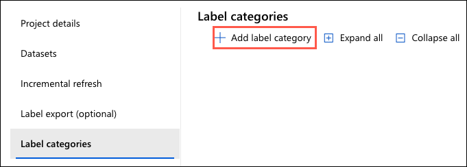
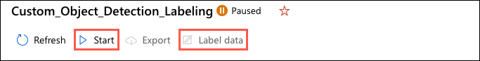
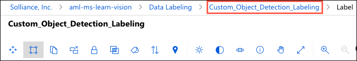
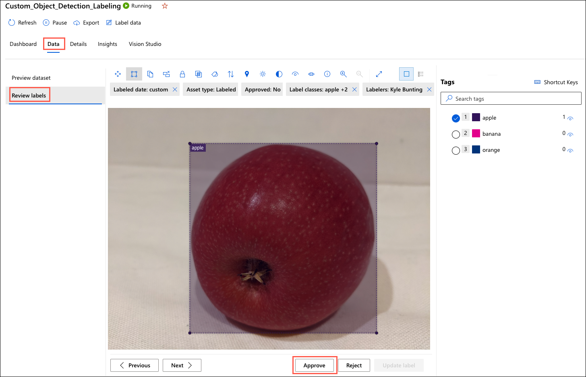
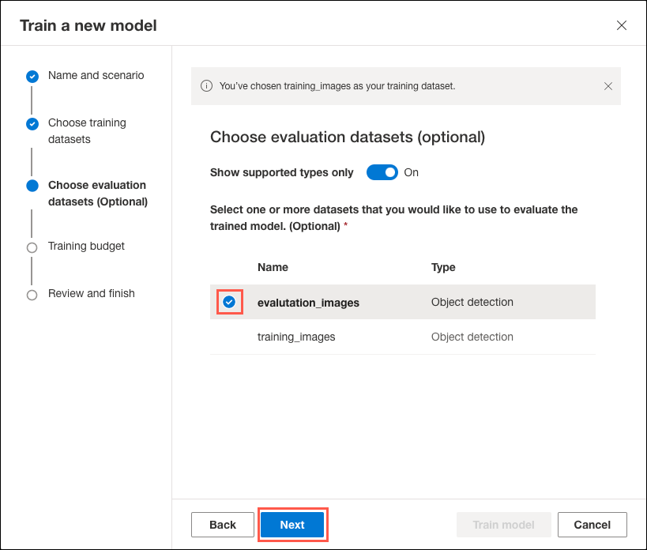
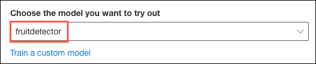

Image Analysis 4.0 enables developers to build custom models leveraging the few-shot learning capabilities of Microsoft's Florence foundation model. In this exercise, you use Vision Studio to create and train a custom **object detection** model capable of identifying and locating three classes of fruit (apple, banana, and orange) within an image.

## Create a custom model training project

In this task, you create a new training project for a custom object detection model in Vision Studio.

1. In a web browser, navigate to [Vision Studio](https://portal.vision.cognitive.azure.com/).

2. From the Vision Studio home page, select the **Image analysis** tab, and then select the **Detect common objects in images** tile.

    

3. Ensure the acknowledgment of resource usage box under the **Try it out** heading is checked and that it references the Cognitive Services account you created in the **Explore Image Analysis** exercise.

    

4. Select **Train a custom model** under **Choose the model you want to try out**.

    

## Create datasets

The first step in training a new model is to create datasets consisting of the images that will be used to train and evaluate the custom model. In the previous exercise, you added photos to blob storage containers named `training-images` and `evaluation-images`. In this task, you will reference the images in those containers to create the datasets required to train and evaluate your custom model.

1. On the **Datasets used by this project** page in Vision Studio, select **Add new dataset** on the toolbar.

    

2. In the **Create a new dataset** dialog, set the following to create your evaluation dataset:

    - **Dataset name**: Enter "evaluation_images".
    - **Dataset type**: Choose **Object detection**.
    - Under **Select Azure blob storage container**, select **Select Container** and in the **Please select the target Azure Blob** dialog, set the following:
      - **Subscription**: Choose your subscription for this exercise.
      - **Storage Account**: Select the **stmslearnvisionSUFFIX** storage account you created for the exercises in this module.
      - **Blob Container**: Choose the **evaluation-images** container.
      - Select the **Select container** button to close the dialog.
    - Check the **Allow Vision Studio to read and write to your blob storage** box.

    

3. Select **Create dataset** on the **Create a new dataset** dialog.

    **Note**: The `evaluation_images` dataset includes a pre-generated COCO file. This file will eliminate the time required to manually label the evaluation images from this exercise. In a real-world scenario, you must create an Azure Machine Learning data-labeling project for the evaluation images and tag your photos to generate the required COCO file.

4. On the **evaluation_images** dataset page, select **Add COCO file** under the **Import COCO file for labeled data** header.

    

5. In the **Import COCO file** dialog, choose the **Import COCO file from a Blob Container** option under **Import method** select the `eval-labels.json` file from the **COCO file** dropdown, then select **Import and add COCO file**

    

6. Next, you will create a dataset for your training images. Select **Datasets** in the left-hand menu to return to the datasets page, and select **Add new dataset** on the toolbar.

    

7. In the **Create a new dataset** dialog, set the following:

    - **Dataset name**: Enter "training_images".
    - **Dataset type**: Choose **Object detection**.
    - Under **Select Azure blob storage container**, select **Select Container** and in the **Please select the target Azure Blob** dialog, set the following:
      - **Subscription**: Choose your subscription for this exercise.
      - **Storage Account**: Select the **stmslearnvisionSUFFIX** storage account you created for the exercises in this module.
      - **Blob Container**: Choose the **training-images** container.
      - Select the **Select container** button to close the dialog.
    - Check the **Allow Vision Studio to read and write to your blob storage** box.

    

8. Select **Create dataset** on the **Create a new dataset** dialog.

    **Note**: Unlike the `evaluation_images` dataset, you will use an Azure Machine Learning data-labeling project to label your training images and create a COCO file.

## Create an Azure Machine Learning data-labeling project

COCO files are used to convey the labeling information associated with your images. The easiest way to generate a COCO file is to create an Azure Machine Learning data-labeling project. In this task, you will use Vision Studio to create an Azure Machine Learning workspace and set up a data-labeling workflow.

1. On the **training_images** dataset page in Vision Studio, select **Create Azure ML Data Labeling Project**.

    

2. On the **Create an Azure ML Data Labeling Project** dialog, enter "Custom_Object_Detection_Labeling" and then select **Create a new workspace**.

    

3. In the new Azure portal tab that opens, enter the following:

    **Resource details**:

    - **Subscription**: Select the subscription you are using for resources in this exercise.
    - **Resource group**: Select the `rg-ms-learn-vision` resource group you created in the previous exercise.

    **Workspace details**:

    - **Workspace name**: Enter a name, such as `aml-ms-learn-vision`.
    - **Region**: Select **East US**.
    - **Storage account**: Accept the default name for a new storage account.
    - **Key vault**: Accept the default name for a new key vault.
    - **Application insights**: Accept the default name for an app insights instance.
    - **Container registry**: Leave **None** selected.

    

4. Select **Review + create** and then select **Create** on the review screen to provision your AML workspace.

5. Select **Go to resource** when the deployment is complete.

    

6. Return to Vision Studio. In the **Create an Azure ML Data Labeling project** dialog, select the refresh button next to the **Workspace** dropdown, then select the new AML workspace you created.

    

    **Important**: If your workspace name does not appear after selecting the **Refresh** button next to the **Workspace** dropdown, wait a few minutes and try again.

7. Select **Confirm** on the **Create an Azure ML Data Labeling Project** dialog.

## Label training images

Using your Azure Machine Learning data-labeling project created, you will pre-label a small subset of your images and then use the ML-assisted labeling capability of Azure Machine Learning to assign tags to the remaining photos. Image Analysis 4.0 models are especially effective at few-shot learning, enabling you to develop accurate models with less training data and reducing the work necessary to create a training dataset. ML-assisted labeling decreases the level of effort even further.

1. In Vision Studio, select the **Go to Azure ML Data Labeling Project - Custom_Object_Detection_Labeling** button to launch Azure Machine Learning Studio in a new browser tab.

    

2. In the open Azure Machine Learning Studio tab, you must add label categories before starting the data-labeling project. Select **Add label categories** in the **Missing label categories** warning message.

    

3. On the **Label categories** page, select **Add label category**.

    

4. In the **Add labels** dialog, select **Add label category** and enter "apple" into the box that appears. Repeat the process two more times, adding "banana" and "orange" as additional labels.

    

5. Select **Save** on the **Add labels** dialog.

6. From the **Label categories** page in Azure Machine Learning Studio,  select the **ML-assisted labeling** item in the left-hand menu and enable ML-assisted labeling by selecting the toggle button. Toggle the **Attempt pre-labeling of manual tasks** option to on. This will kick off an inference run after training a labeling model and attempt to label the remaining images in the `training_images` dataset. Then select **Save**, accepting the default values for the remaining fields.

    

7. After adding the required labels and enabling ML-assisted labeling, select **Start** on the toolbar and then select **Label data**. You may need to select **Refresh** on the toolbar to enable the **Label data** button.

    

8. For this exercise, you will use **ML-assisted labeling**, which requires pre-labeling a subset of your images. To begin pre-labeling your pictures, select the label you want to apply under **Tags** on the right-hand side of the window, then draw a bounding box around the object in the picture. Once that is complete, select **Submit** for the image.

    

    An image is just an array of pixel values to an AI application. By drawing bounding boxes around tagged objects, you define the pixel array that identifies an object within the picture. Those numeric pixel values can be used as features to train machine learning models that make predictions about the image and its contents.

    **Important**: If an image contains more than one object, select the label you want first and then draw a bounding box around each object on the image before choosing **Submit**.

    

9. Continue labeling images in the dataset, adding tags and bounding boxes to at least twelve photos. The required number of pre-labeled images varies by dataset, but twelve should meet this dataset's minimum number of pre-labeled photos. There are 53 images in the `training_images` dataset. You will see a tasks remaining value of **41/53** once you have submitted the twelfth image.

    

10. Select the **Custom_Object_Detection_Labeling** project in the breadcrumbs at the top of Azure Machine Learning Studio to return to your data-labeling project page.

    

11. On the page for your data-labeling project, select the **Details** tab, **ML-assisted labeling**, and then select **Start** in the **On-demand training** tile.

    

    It will take about 15 minutes for the ML-assisted labeling training experiment to run. You can view the status at the bottom of the **Dashboard** page. Use the **Refresh** button on the data-labeling project's toolbar to check for status updates.

    

    Once the training experiment has been completed, the inference experiment will automatically begin. The inference experiment should finish within a minute or two. Select **Refresh** on the toolbar to check for status updates.

    

12. When the inference experiment finishes, select **Label data** from the toolbar.

    

13. You will now see images pre-labeled by the ML-assisted labeling service. Review each image, confirm the ML-assigned label, and adjust any bounding boxes as necessary. Select **Submit** for each picture after you have reviewed it.

14. If you have images not pre-labeled by the ML-assisted labeling experiment, select the appropriate tag and draw a bounding box around the object in the image to complete the labeling process of all photos in the `training_images` dataset.

15. When all your images have been labeled, select the **Custom_Object_Detection_Labeling** project in the breadcrumbs at the top of Azure Machine Learning Studio to return to your data-labeling project page.

    

16. Next, you should review and approve the labels assigned to each image before generating a COCO file. The approval process allows you to check tags set by other taggers and either approve or reject them.

    

17. After reviewing and approving the labels assigned to each image in the training dataset, select the **Vision Studio** tab, and then select **Go to Vision Studio**.

    

18. In the Vision Studio browser tab, select **Add COCO file** under **Import COCO file for labeled data**.

    

19. In the **Import COCO file** dialog:

    - **Import method**: Select **Import COCO file from an Azure ML Data Labeling project**.
    - **COCO file name**: Enter "training-labels."
    - **Subscription**: Choose your subscription for this exercise.
    - **AML Workspaces**: Choose the `aml-ms-learn-vision` workspace you created for this exercise.
    - **AML Projects**: Select the `Custom_Object_Detection_Labeling` project you used to label your train images.

    

20. Select **Import and add COCO file** to import the COCO file from Azure ML and add it to the Storage Account container hosting your training images.

## Train the custom object detection model

With your images labeled and the COCO annotation file imported, you can use Vision Studio to train your custom model.

1. In Vision Studio, select **Custom models** in the left-hand menu, then select **Train a new model** in the toolbar.

    

2. On the **Name and scenario** tab of the **Train a new model** dialog, enter "fruitdetector" into the **Customize the name of this model** box, select **Object detection** for the model type, then select **Next**.

    

3. On the **Choose training datasets** tab, check the box next to the **training_images** dataset and select **Next**.

    

4. On the **Choose evaluation dataset** tab, check the box next to the **evaluation_images** dataset and select **Next**.

    

5. Leave the training budget set to **1 hour** and select **Next** on the **Training budget** tab.

    

6. On the **Review and finish** tab, select **Train model** to start the training process.

    

7. The initial **Status** of the model training job will be Queued. Within a minute or two, you should see the status change to **Training** after selecting **Refresh**.

    

    It can take about an hour for the training to complete. Image Analysis 4.0 models can be accurate with only a small set of training data, but they take longer to train than previous models. You can periodically select **Refresh** to look for an updated status. When model training has been completed, the status will change to **Succeeded***.

    

8. Once your model training is finished, select the model on the Custom models page in Vision Studio.

9. On the `fruitdetector` page, you can review the model's overall performance and evaluation results.

    

## Test your custom model in Vision Studio

Once your custom model is created and trained, it belongs to your Computer Vision resource, and you can call it using the Analyze Image API. It will also be available to test from within Vision Studio.

1. Return to the Vision Studio home page, select the **Image analysis** tab, and then select the **Detect common objects in images** tile.

    

2. Under **Choose the model you want to try out**, select your custom **fruitdetector** model from the dropdown list.

    

3. Open the folder containing the images you downloaded and unzipped to your local machine and locate the folder named `test-images`.

4. The `test-images` folder contains four images: an apple, a banana, an orange, and one containing a single piece of each fruit. One at a time, drag each of the images in the folder to the **Drag and drop files here** box in Vision Studio, or browse to the location you downloaded the files and select them from there.

    

5. Observe the prediction results for each image.

    

Congratulations! You have used Vision Studio to create a custom object detection model featuring the improved capabilities of Image Analysis 4.0 delivered by Microsoft's Florence foundation model.

## Clean up

You should clean up any Azure resources created during the exercises in this module to avoid being charged for unused services and resources. To delete the resources you created for this module, follow these instructions:

1. Open a web browser and navigate to the [Azure portal](https://portal.azure.com/).
2. In the left-hand navigation menu, select **Resource Groups**, and then select the `rg-ms-learn-vision` resource group you created as part of the exercise in Unit 5.
3. In the **Overview** pane, select **Delete resource group**.
4. Enter the name of the resource group you created to confirm and then select **Delete**.
